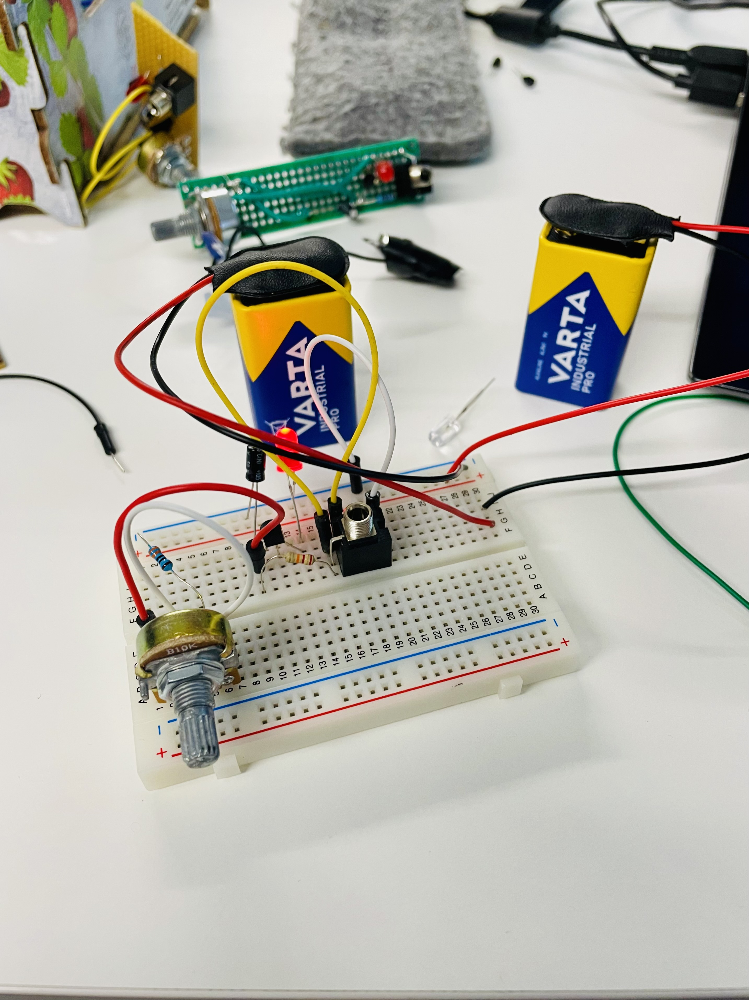
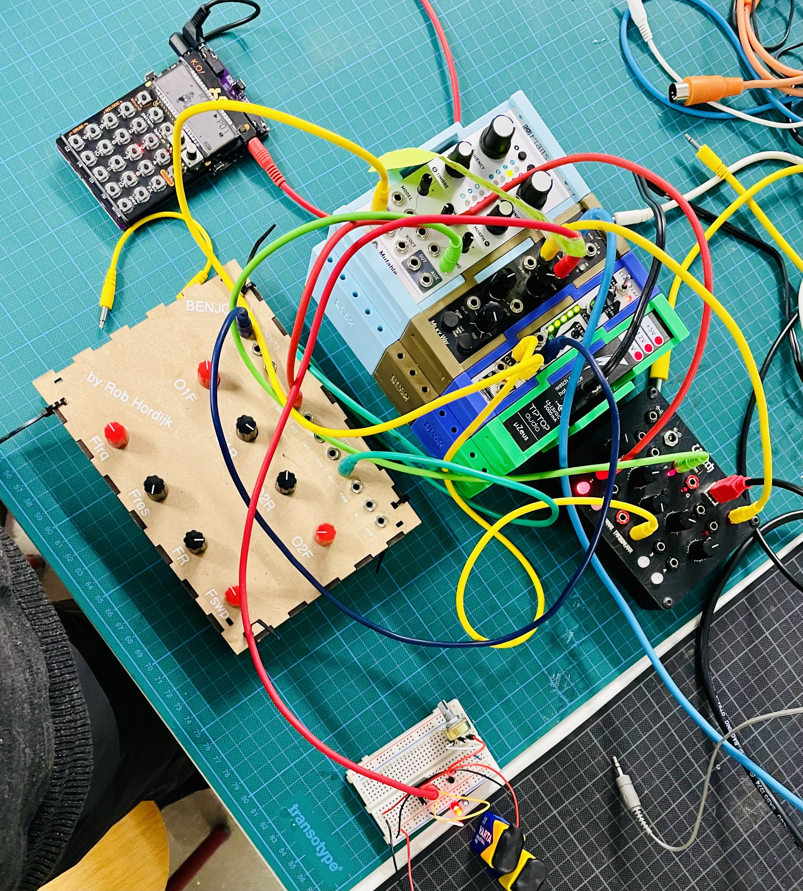

# Avalanche Project

## Task
We will reverse engineer a very simple synthesiser - the [Mt. Brighton Avalanche Oscillator](https://github.com/NorthCoastModularCollective/Mt.-Brighton-Avalanche-Oscillator).  
An avalanche oscillator is a simple audio circuit that generates a continuous waveform, that is ideal for learning basic electronics and synthesis. 

## Components
In the kit we will find: 
- two 9v batteries  
- two battery clips  
- a 330Ω resistor  
- a 22kΩ resistor  
- a 2.2µF capacitor  
- a 2N3904 transistor  
- a LED  
- a linear 10KΩ potentiometer  
- a 3.5mm Thonkiconn audio connector  
- a small piece of prototyping board (perfboard or stripboard)  
In addition to the above, you may use wire to connect between points on the board.

## First try on the breadboard
The led is lighting. This is already a good sign. 
  
  

### Links
[Mak your own power supply? ](https://www.instructables.com/Make-a-simple-12-volt-power-supply/)  
[Mt. Brighton Avalanche Oscillator](https://github.com/NorthCoastModularCollective/Mt.-Brighton-Avalanche-Oscillator)
